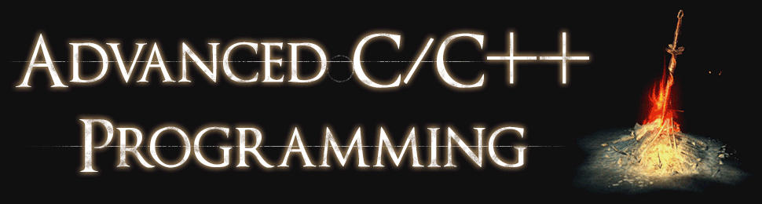

## Grading

Throughout this course you have to complete 2 assignments.

- [Assignment 1](assignment1) has 9 points to score
- [Assignment 2](assignment2) has 11 points to score
- You need at least 13 points to pass this course

Points will be subtracted for shortcomings discovered during evaluation.
This includes things like:

- Executables *segfaulting*
- Unnecessary waste of time or space (memory leaks)
- …

Attendance is not required for this course.

## Exercises

While the previous iterations of this course leveraged weekly exercise sheets, this one does not.
However, I would like to keep these exercises around as they support the lecture and explore certain auxiliary topics relevant to C++.
You are encouraged to solve (or at least think about) these exercises and participate in the discussions during the stream.
You will not submit a solution as these exercises are optional, but feel free to ask questions when running into problems.

The [`exercises`](exercises) folder will be updated throughout the semester.

## C++ Related Questions

Break code specific questions down to a minimal example.
State your question and observations as comments in the code.
Please use [Compiler Explorer](https://compiler-explorer.com/) and its short link functionality under *Share*.

## Contacting Me

You can contact me by email, just be sure to send it from your university account.
Please keep your email informal and include the course number in the subject.
Preferably use the following link.

📧 [send email](mailto:alexander.hirsch@uibk.ac.at?subject=703807%20-%20)

## Essential References

- [C++ 17 Standard (Draft)](http://www.open-std.org/jtc1/sc22/wg21/docs/papers/2017/n4659.pdf)
- [C++ Core Guidelines](http://isocpp.github.io/CppCoreGuidelines/CppCoreGuidelines)
- [cppreference.com](http://en.cppreference.com)

## Talks 🎥

- [CppCon 2018 — *Simplicity: Not Just For Beginners*](https://www.youtube.com/watch?v=n0Ak6xtVXno)
- [CppCon 2019 — *Naming is Hard: Let's Do Better*](https://www.youtube.com/watch?v=MBRoCdtZOYg)
- [CppCon 2015 — *Give me 15 minutes & I'll change your view of GDB*](https://www.youtube.com/watch?v=PorfLSr3DDI)
- [CppCon 2018 – *OOP is dead, long live Data-oriented design*](https://www.youtube.com/watch?v=yy8jQgmhbAU)

## Useful References / Tools

- [Awesome Modern C++](https://github.com/rigtorp/awesome-modern-cpp)
- [Boost](http://www.boost.org)
- [C++ 20 Standard (Draft)](https://isocpp.org/files/papers/N4860.pdf)
- [Clang Sanitizers](https://clang.llvm.org/docs/UsersManual.html#controlling-code-generation)
- [Clang Tidy](http://clang.llvm.org/extra/clang-tidy/)
- [CMake](https://cmake.org)
- [Curated List of Awesome C/C++ Stuff](https://github.com/fffaraz/awesome-cpp)
- [DevDocs](https://devdocs.io/)
- [Doxygen](http://www.stack.nl/~dimitri/doxygen)
- [Google C++ Style Guide](https://google.github.io/styleguide/cppguide.html)
- [Google Test](https://github.com/google/googletest)
- [Modern C++ Features](https://github.com/AnthonyCalandra/modern-cpp-features)
- [Modern CMake](https://cliutils.gitlab.io/modern-cmake/)
- [Online C++ Demangler](https://demangler.com)
- [STL Containers](http://en.cppreference.com/w/cpp/container)
