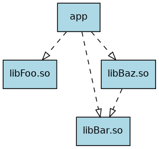

# Exercises

## Task 01

Install G++ and Clang, then compile the provided file [`hello.cpp`](task01/hello.cpp).
Use the following flags when compiling:

    -std=c++17 -Wall -Wextra -O2

Next, set up [Boost](http://www.boost.org/) on your system and compile the provided file [`hello_boost.cpp`](task01/hello_boost.cpp).
Boost is quite common and provides you a set of useful C++ libraries.
Some of its content is even promoted into the C++ standard library.

## Task 02

Run Clang on the provided file [`vec.cpp`](task02/vec.cpp) using the following command:

    clang -std=c++17 -Xclang -ast-dump -fsyntax-only -Wno-vexing-parse vec.cpp

Clang will parse the input file and display its abstract syntax tree (AST).
In the bottom half of the output you'll find the function declaration of `main` followed by its `CompoundStmt`.
Take a close look at its children and compare the resulting AST with the input code.
Notice any oddities — something that looks counter intuitive?

As you can see, there are multiple different ways of initialisation in C++.
Check out the [corresponding section at cppreference](https://en.cppreference.com/w/cpp/language/initialization).

## Task 03

The directory [`task03`](task03) hosts four subdirectories, `libFoo`, `libBar`, `libBaz`, and `app`.

Each folder prefixed with `lib` represents a library and contains a header plus a source file.
Furthermore, the library `libBaz.so` depends on `libBar.so`.

`app` contains a single source file providing a `main` function.
It depends on all three libraries.



- Model this project structure using [CMake](https://cmake.org/)
- Be sure to set the C++ standard to C++17 and enable warnings (`-Wall -Wextra`)
- The default build type should be *Release*

CMake itself is a build system generator.
You can choose from a variety of target build systems.

## Task 04

Examine the program [`iterations.cpp`](task04/iterations.cpp) and think about the expected output.
Compile the program and run it.
What do you notice?
Did you expect this behaviour?
Did you get any compiler warnings?
Investigate what is actually happening (consider using `valgrind` or a debugger).

How can such errors be prevented?
Look for tools (e.g. static code analysers) which help discovering such faulty code.

**Note:** If you run the executable and everything seems normal, try changing the initial content of `xs`, using different optimisation flags, or a different compiler.
The actual behaviour of this executable depends on various factors.

See [Iterator Invalidation](https://en.cppreference.com/w/cpp/container#Iterator_invalidation).

## Task 05

You are given the program [`strange.cpp`](task05/strange.cpp).
Compile it with different compilers and optimisation flags.
What do you notice?
What is really happening here?

See [Undefined Behaviour](https://en.cppreference.com/w/cpp/language/ub) and [Defining the undefinedness of C](https://dl.acm.org/citation.cfm?id=2737979).

## Task 06

This task focuses on the correct implementation of RAII as well as copy and move semantics.
You are asked to implement the concept of `unique_ptr` and `shared_ptr`.
Since we won't concern ourselves with templates for the moment your implementation will *own* an instance of the following `struct`.

```cpp
struct Vec2 {
    float x, y;
};
```

- Read the documentation regarding *smart pointers*, `unique_ptr`, and `shared_ptr`
- Implement your version of `unique_ptr_to_vec2` and `shared_ptr_to_vec2` fulfilling these requirements:
  - *Dynamically* allocate an instance of `Vec2` in your constructor
  - De-allocate the `Vec2` instance in your destructor
  - Implement correct copy semantics (copy constructor / copy assignment)
  - Implement correct move semantics (move constructor / move assignment)
  - Enable access to `Vec2` via the operators `*` and `->`
  - Thread-safety for `shared_ptr_to_vec2`'s reference counter is not required
  - Pay attention to corner-cases like self-assignment (`v = v`)
- Prepare a few interesting test cases
- Check your implementation for memory leaks and memory corruptions using `valgrind` and sanitizers

See [Rule of Three](https://en.wikipedia.org/wiki/Rule_of_three_(C%2B%2B_programming)).

## Task 07

Read [this blog post](https://www.gamedev.net/blogs/entry/2265481-oop-is-dead-long-live-oop).

- Pay attention to *implementation vs. interface inheritance*
- Pay attention to the use of templates (assuming you've already covered them)
    - Think about the benefits and drawbacks of the used patterns

## Task 08

You are given the following definition of a person:

```cpp
struct Person {
    std::string firstName;
    std::string lastName;
    int age;
};
```

- Implement relational operators (`<`, `<=`, `>`, `>=`)
- Implement comparison operators (`==`, `!=`)

Next, create 5 different instances and put all of them
- in an `std::vector`;
- in an `std::set`; and
- in an `std::map` as key (we don't care about the value type of the map).

Use algorithms from the standard library, like `std::find` and `std::partition` on these containers and examine which operators are used.

*Hint:* You may want to have a look at `std::tie`.

## Task 09

Reuse `Person` from Task 08 and implement the necessary parts for inserting it into an `std::unordered_set`.

Compare the performance of:

- `std::vector`
- `std::list`
- `std::set`
- `std::unordered_set`

## Task 10

Have a look at [this](https://bollu.github.io/mathemagic/declarative/index.html).
Now, do that in C++!

Utilize lambdas, `std::function`, and/or structs with call operators.
Critically think about ownership and minimize the amount of heap allocations.

## Task 11

Take a look at [Boost's chat server example](https://www.boost.org/doc/libs/1_74_0/doc/html/boost_asio/examples/cpp11_examples.html#boost_asio.examples.cpp11_examples.chat).
Try to understand how the session's lifetime is managed by the server.
Focus on `std::enable_shared_from_this` in combination with lambda captures.
